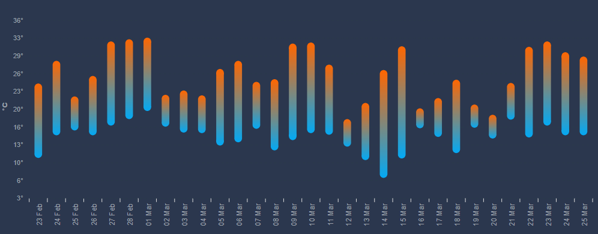
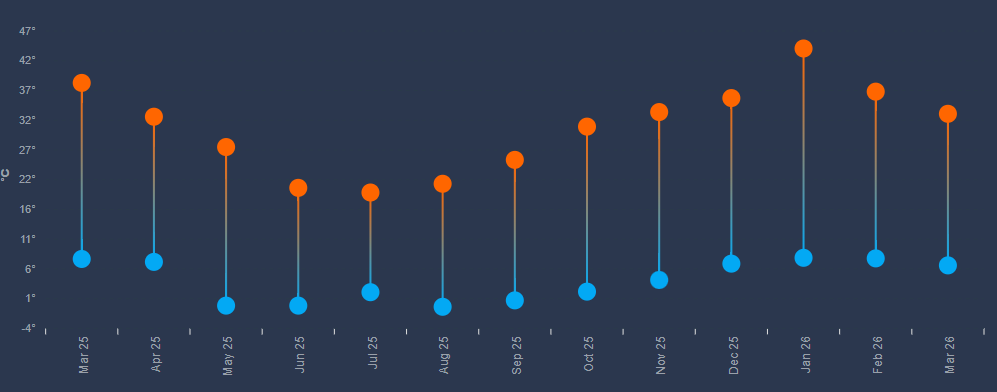

# ha-temp-range-card

A custom Home Assistant Lovelace card that displays daily, weekly, or monthly temperature ranges as a dumbbell or pill-bar chart. Inspired by the forecast-style range bars in the `clock-weather-card`.




## Features

- 📊 Dumbbell chart (dots + connecting line) or pill bar style
- 🎨 Gradient coloring from min to max temperature
- 📅 Configurable period: `day`, `week`, or `month`
- 🔧 Fully configurable appearance
- 📡 Loads ApexCharts locally with CDN fallback
- 🏠 Uses Home Assistant's built-in statistics recorder — no extra integrations needed

## Requirements

- Home Assistant 2023.0 or later
- A temperature sensor with long-term statistics enabled
- ApexCharts (bundled locally or loaded from CDN automatically)

## Installation

### HACS (Recommended)

1. Open HACS in Home Assistant
2. Go to **Frontend**
3. Click the three-dot menu → **Custom repositories**
4. Add `https://github.com/YOUR_USERNAME/temp-range-card` with category **Lovelace**
5. Install **Temperature Range Card**
6. Add the resource (HACS does this automatically)

### Manual

1. Download `temp-range-card.js` from the [latest release](https://github.com/YOUR_USERNAME/temp-range-card/releases)
2. Copy to `/config/www/temp-range-card.js`
3. Go to **Settings → Dashboards → Resources**
4. Add `/local/temp-range-card.js` as a **JavaScript Module**
5. Hard refresh your browser

### Optional: Local ApexCharts (recommended for reliability)

Download ApexCharts locally to avoid CDN dependency:

```bash
wget -O /config/www/apexcharts.min.js \
  https://cdn.jsdelivr.net/npm/apexcharts/dist/apexcharts.min.js
```

The card will automatically use the local file if present, otherwise falls back to the CDN.

## Configuration

```yaml
type: custom:temp-range-card
```

### Full configuration reference

```yaml
type: custom:temp-range-card
grid_options:
  columns: full
  rows: 8

# Header
title: Outside Temperature Range - 30 Days  # default: 'Outside Temperature Range'
show:
  title: true        # set to false to hide the header

# Data
entity: sensor.my_temperature_sensor        # required: your temperature sensor entity
period: day          # day | week | month  (default: day)
span: 30             # number of periods to show (default: 30 for day, 12 for week/month)

# Bar appearance
bar_width: 12        # bar width in pixels (e.g. 12) or percentage (e.g. "40%")
                     # omit to use ApexCharts default
border_radius: 6     # rounded bar ends in pixels (0 = square, default: 0)
gradient: true       # gradient from min_color to max_color (default: true)

# Dots (dumbbell style)
dot_visible: false   # true = dumbbell with dots, false = clean pill bars (default: true)
dot_size: 6          # dot size in pixels, only used when dot_visible: true (default: 6)

# Colors
min_color: "#03a9f4" # color for minimum temperature dot/end (default: blue)
max_color: "#ff6600" # color for maximum temperature dot/end (default: orange)

# Y axis
y_min: 0             # minimum y axis value (default: auto = data min - 3°)
y_max: 45            # maximum y axis value (default: auto = data max + 3°)

# X axis labels
date_format: "DD MMM"   # date format tokens: DD, MM, MMM, MMMM, YY, YYYY
                        # default: "DD MMM" for day/week, "MMM YY" for month
label_rotate: -45       # label rotation in degrees (default: -45)

# Chart
height: 400          # chart height in pixels (default: 400)
```

### Examples

#### Daily pill bars (30 days)
```yaml
type: custom:temp-range-card
entity: sensor.outdoor_temperature
period: day
span: 30
bar_width: 12
border_radius: 6
dot_visible: false
gradient: true
grid_options:
  columns: full
  rows: 8
```

#### Monthly dumbbell (12 months)
```yaml
type: custom:temp-range-card
entity: sensor.outdoor_temperature
period: month
span: 12
dot_visible: true
dot_size: 8
gradient: true
date_format: "MMM YY"
grid_options:
  columns: full
  rows: 8
```

#### Custom colors
```yaml
type: custom:temp-range-card
entity: sensor.outdoor_temperature
min_color: "#00bcd4"
max_color: "#e53935"
gradient: true
```

## How it works

The card queries Home Assistant's built-in `recorder/statistics_during_period` WebSocket API to retrieve daily/weekly/monthly min and max statistics for your sensor. No cloud dependency, no extra integrations — just your local HA recorder data.

ApexCharts is used for rendering. The card loads from `/local/apexcharts.min.js` if available, otherwise falls back to the jsDelivr CDN.

## Acknowledgements

- [ApexCharts](https://apexcharts.com) — charting library (MIT License)
- [clock-weather-card](https://github.com/pkissling/clock-weather-card) — inspiration for the range bar style
- Home Assistant community

## License

MIT License — see [LICENSE](LICENSE) for details.
